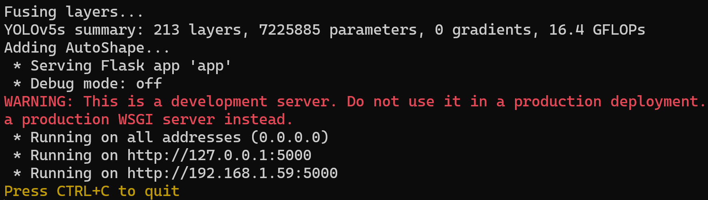
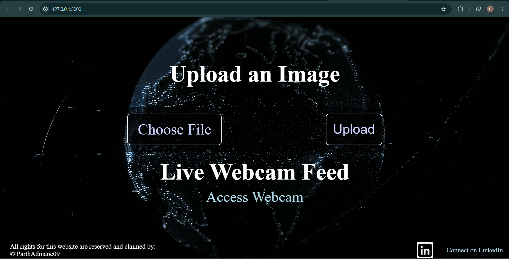

Hey fabulous friend! 🌸
  My new project is a showstopper with YOLOv5’s amazing object detection, 
wrapped up in the eye-catching front-end pages. It's like the tech world got a glamorous makeover!✨
Explore the awesomeness on my GitHub repo and be part of this dazzling journey. Let’s sprinkle some sparkle and smarts
together! 🌟🔍🎉

Step-by-step process:
 - Firstly, clone my Repo☑️.
 - RUN : cd Object-Detection-with-Front_end-API
 - Then we have to download all the dependencies : pip install -r requirements.txt
 - Your setup is completed👍
 - For running the project, we have to simply run the app🔥 : RUN - python app.py
 - http links will be generated on your terminal like this⬇️.
  
 - 
   
 - Press CONTROL + LINK to open the index.html page🧩.
   
 - 

